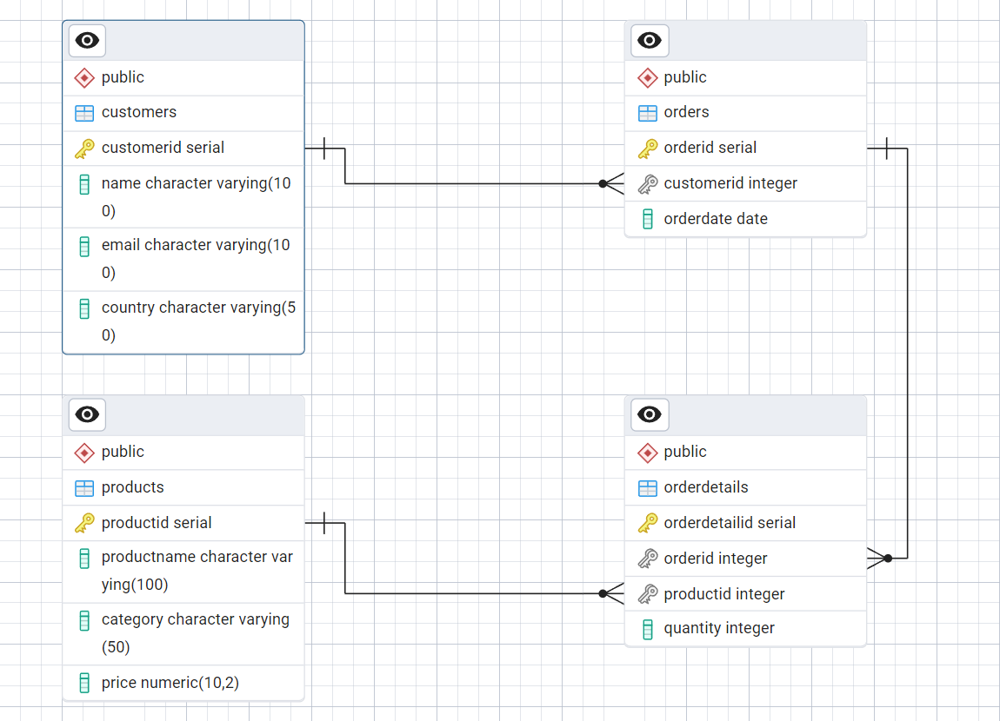

# Retails-Sales-Analysis using SQL

This case study project focuses on analyzing transactional retail sales data using **PostgreSQL**. It covers everything from creating the database schema to writing SQL queries that generate meaningful business insights.

---

## 📌 Objectives

- Design a relational database schema for retail transactions  
- Clean and explore the dataset  
- Write SQL queries to uncover sales trends, customer behavior, and category performance  

---

## 🧾 Dataset Overview

| Field           | Description                          |
|----------------|--------------------------------------|
| transactions_id| Unique transaction ID                |
| sale_date       | Date of transaction                  |
| sale_time       | Time of transaction                  |
| customer_id     | Unique customer identifier           |
| gender          | Gender of customer                   |
| age             | Age of customer                      |
| category        | Product category                     |
| quantity        | Number of items sold                 |
| price_per_unit  | Price per item                       |
| cogs            | Cost of goods sold                   |
| total_sale      | Total sales value                    |

---

## 🧠 Key SQL Tasks

✅ Create database and table  
✅ Remove NULL entries  
✅ Count transactions, customers, and categories  
✅ Category-wise and gender-wise insights  
✅ Top 5 customers by total spending  

---

## 📊 Entity Relationship Diagram (ERD)

The schema is visualized below:

---

## 💻 Files Included

| File Name                 | Description                                |
|--------------------------|--------------------------------------------|
| `Retail_sales.sql`       | Full SQL schema and analysis queries       |
| `Retail Sales Analysis.txt` | Project write-up with explanation         |
| `Schemas.png`            | Visual ERD of database structure           |

---

## 📬 Contact

**Rajat Ganar**  
📧 rgrajat2001@gmail.com  
🌐 [LinkedIn](https://www.linkedin.com/in/rajat-ganar-40a0a7240/)
